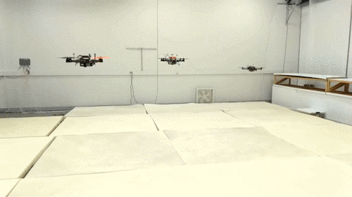

# ViconMAVLink
ViconMAVLink is an application to provide indoor positioning for networked robots using Vicon motion capture measurements. It is primarily used in the [Intellegent Robotics Lab](http://robotics.illinois.edu) at the University of Illinois as a tool to simulate indoor GPS for Linux-based autonomous vehicles, such that you can operate autonomous vehicles indoors:

_A fleet of UAVs flying with simulated GPS_:

 

_Heterogeneous autonomous vehicles controlled via tablet groundcontrol_:

 

# Dependencies
ViconMAVLink uses the following libraries:
* [Vicon DataStream SDK](https://www.vicon.com/products/software/datastream-sdk): to obtain real-time, high-precision positioning measurement for objects.
* [MAVLink library](http://qgroundcontrol.org/mavlink/start): to encode/unpack UDP data with the MAVLink protocol.
* [GeographicLib](https://geographiclib.sourceforge.io/): to convert positioning data between local coordinates and GPS locations.
* [QT5](https://www.qt.io/) (core gui widgets network concurrent): to provide a GUI, networking and multithreading.

As long as you have all required libraries added to the Qt project file. This application can be built for multiple platforms in [QtCreator](https://www.qt.io/qt-features-libraries-apis-tools-and-ide/).

# User's Guide
You can run this app directly on the Vicon server computer or on any other computers as long as they are in the same network as the Vicon server computer. After you launch the application, the main window will appear. But, the capture objects list is empty because you haven't connected to Vicon yet. 

* The `HostAddress` is the IP address of the Vicon server computer. 
* The `HostPort` usually is `801`. This is the port used by Vicon.
* The `North` mapping: Vicon uses a _Forward-Left-Up_ coornidates while the `LOCAL_POSITION_NED` message in MAVLink uses _North-East-Down_, to make the situation more confusing, GeographicLib uses a _East-North-Up_ coordinates. To convert position data correctly, you need to map your Vicon axis first. Assuming you calibrated Vicon according to the manual, just choose the correct half-axis that corresponds to North then this app will handle the mapping correctly.

__To connect to Vicon__: Click `Menu`->`Connect Vicon` then objects that are captured by Vicon will appear in the Captured Objects List.

__To launch a sender for a robot__: Choose an object then Click `Start a MavLink Sender`, the Sender's window appears. After you start sending data, the `Rate` slider is still adjustable to change the sending rate on-the-fly.

You may launch multiple senders for a fleet of robots:

# Developer's Guide
The Station object will launch a separate thread to communicate with Vicon. A Writer/Reader lock is used to synchronize data. The Station object is the writer and Sender objects are the readers who fetch raw measurement from the Station. The raw measurement includes position (unit: mm) and a quarternion encapsulated in a `mavlink_att_pos_mocap_t` object. Since Vicon does not output velocities, the Sender uses a linear Kalman filter to compute a `mavlink_local_position_ned_t` object with positions and velocities. The `GPS_HIL` data is then computed with the local position object. The Station and Sender objects and windows use the Model-View-Controller pattern.

